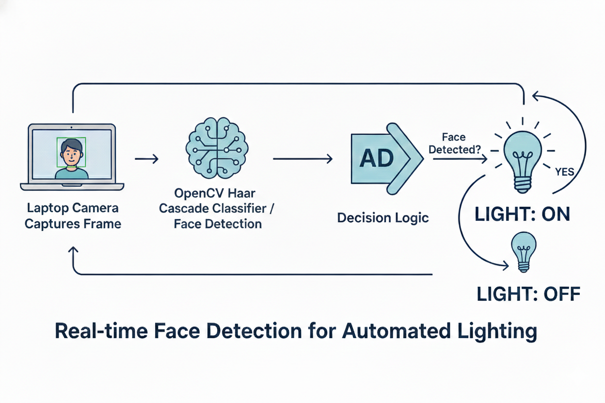
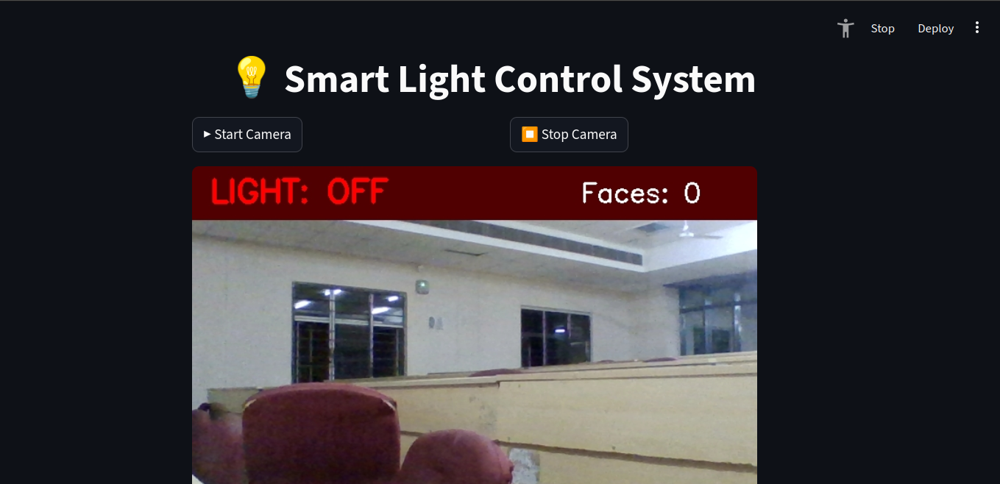

# 💡 Smart Light Control System

A real-time computer vision project that detects human presence using a laptop camera and automatically controls light status.

If a face is detected → **LIGHT ON**
If no face is detected → **LIGHT OFF**

---

## 🚀 Features

* 🎥 Real-time face detection using OpenCV
* 💡 Automatic light ON/OFF logic
* 🖥️ Interactive UI using Streamlit
* 📊 Displays face count and status inside video frame
* ⚡ Works on basic laptops (no GPU required)

---

## 🧠 How It Works

Camera → Face Detection → Decision → Display (UI)

* Captures live video from camera
* Detects faces using Haar Cascade
* Applies decision logic
* Displays result with visual overlay



---

## 📁 Project Structure

```
smart_light_control/
│
├── app.py              ← Streamlit app (main file)
├── requirements.txt    ← Dependencies
├── PPT.pdf             ←  Presentation pdf
├── Sample_Output/
│   ├── Output1.png
│   ├── Output2.png
├── README.md
```

---

## ⚙️ Installation

```bash
git clone <your-repo-link>
cd smart_light_control
pip install -r requirements.txt
```

---

## ▶️ Run the App

```bash
streamlit run app.py
```

Then open:

```
http://localhost:8501
```

---

## 🎮 Usage

* Click **Start Camera**
* Sit in front of camera → 💡 LIGHT ON
* Leave camera → 💡 LIGHT OFF
* Click **Stop Camera** to exit

---

## 🖼️ Demo



---

## ❌ Common Errors & Fixes

| Error              | Solution                                  |
| ------------------ | ----------------------------------------- |
| Camera not opening | Close Zoom/browser using camera           |
| No module cv2      | Install using `pip install opencv-python` |
| Slow performance   | Close background apps                     |

---

## 🚀 Future Improvements

* 🔌 Connect with Arduino for real light control
* 🧠 Replace Haar Cascade with deep learning models
* 📊 Add analytics dashboard
* 🌐 Deploy on cloud

---

## 🧑‍💻 Tech Stack

* Python
* OpenCV
* Streamlit

---

## ⭐ Conclusion

This project demonstrates how computer vision can be used for real-world automation like energy saving and smart environments.

